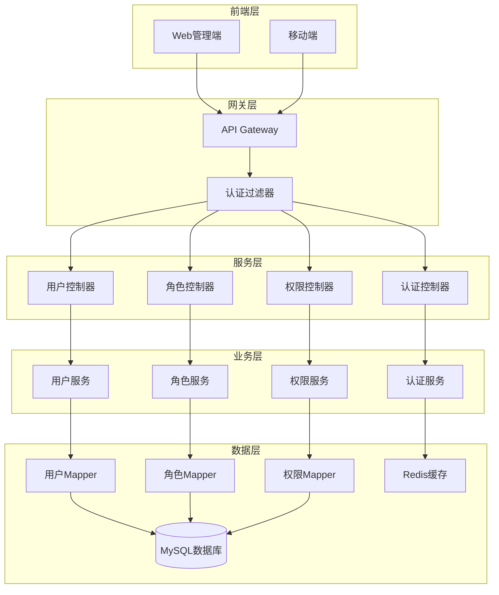

# 🏦 JOSP-accountManageJava - 账号管理系统后端


> ⚠️ 项目状态: 规划中,暂无实际代码

## 📖 项目简介

JOSP-accountManageJava 是规划中的账号管理系统后端服务,计划提供用户账号的统一管理、权限控制和认证授权功能。

**前端项目**: [JOSP-accountManagerVue3](../JOSP-accountManagerVue3)

## ⚠️ 项目状态

**当前状态**: 项目规划阶段

**已有内容**:
- ✅ LICENSE文件 (AGPL-3.0)
- ✅ README文档

**待开发内容**:
- ⏳ 项目代码结构
- ⏳ 用户管理功能
- ⏳ 角色管理功能
- ⏳ 权限管理功能
- ⏳ 认证授权功能

## 🎯 计划功能

### 核心模块
- 用户管理 - 用户增删改查
- 角色管理 - 角色定义与分配
- 权限管理 - 权限控制
- 认证授权 - 登录认证

## 🏗️ 系统架构



## 🚀 快速开始

### 环境要求

- JDK 17+
- Maven 3.6+
- MySQL 8.0+
- Redis 6.0+

### 安装步骤

```bash
# 1. 克隆项目
git clone https://github.com/yourusername/JOSP-accountManageJava.git

# 2. 进入项目目录
cd JOSP-accountManageJava

# 3. 配置数据库
# 修改 src/main/resources/application.yml
spring:
  datasource:
    url: jdbc:mysql://localhost:3306/account_manage?useUnicode=true&characterEncoding=utf-8
    username: root
    password: your_password

# 4. 初始化数据库
mysql -u root -p < db/schema.sql

# 5. 编译项目
mvn clean install

# 6. 运行项目
mvn spring-boot:run
```

## 🛠️ 技术栈

| 技术 | 版本 | 说明 |
|------|------|------|
| Spring Boot | 3.x | 应用框架 |
| MyBatis | 3.5+ | ORM框架 |
| MySQL | 8.0+ | 关系数据库 |
| Redis | 6.0+ | 缓存数据库 |
| Spring Security | 3.x | 安全框架 |
| JWT | - | 令牌认证 |
| Maven | 3.6+ | 项目管理工具 |

## 📁 项目结构

```
JOSP-accountManageJava/
├── src/
│   ├── main/
│   │   ├── java/
│   │   │   └── com/josp/account/
│   │   │       ├── controller/      # 控制器层
│   │   │       ├── service/         # 业务逻辑层
│   │   │       ├── mapper/          # 数据访问层
│   │   │       ├── entity/          # 实体类
│   │   │       ├── dto/             # 数据传输对象
│   │   │       ├── config/          # 配置类
│   │   │       ├── security/        # 安全配置
│   │   │       └── utils/           # 工具类
│   │   └── resources/
│   │       ├── mapper/              # MyBatis映射文件
│   │       ├── application.yml      # 配置文件
│   │       └── db/                  # 数据库脚本
│   └── test/                        # 测试代码
├── pom.xml                          # Maven配置
└── README.md                        # 项目说明
```

## 🔑 核心功能

### 用户管理

```java
@RestController
@RequestMapping("/api/users")
public class UserController {
    
    @Autowired
    private UserService userService;
    
    @PostMapping
    public Result<User> createUser(@RequestBody UserDTO userDTO) {
        return Result.success(userService.createUser(userDTO));
    }
    
    @GetMapping("/{id}")
    public Result<User> getUserById(@PathVariable Long id) {
        return Result.success(userService.getUserById(id));
    }
    
    @PutMapping("/{id}")
    public Result<User> updateUser(@PathVariable Long id, @RequestBody UserDTO userDTO) {
        return Result.success(userService.updateUser(id, userDTO));
    }
    
    @DeleteMapping("/{id}")
    public Result<Void> deleteUser(@PathVariable Long id) {
        userService.deleteUser(id);
        return Result.success();
    }
}
```

### 角色权限管理

```java
@Service
public class RoleService {
    
    @Autowired
    private RoleMapper roleMapper;
    
    public void assignRoleToUser(Long userId, Long roleId) {
        // 分配角色给用户
        roleMapper.insertUserRole(userId, roleId);
    }
    
    public void assignPermissionToRole(Long roleId, Long permissionId) {
        // 分配权限给角色
        roleMapper.insertRolePermission(roleId, permissionId);
    }
}
```

### 认证授权

```java
@Service
public class AuthService {
    
    @Autowired
    private UserService userService;
    
    @Autowired
    private JwtTokenUtil jwtTokenUtil;
    
    public String login(String username, String password) {
        // 验证用户
        User user = userService.authenticate(username, password);
        
        // 生成JWT令牌
        return jwtTokenUtil.generateToken(user);
    }
    
    public boolean validateToken(String token) {
        return jwtTokenUtil.validateToken(token);
    }
}
```

## 📊 API文档

### 用户管理API

| 接口 | 方法 | 路径 | 说明 |
|------|------|------|------|
| 创建用户 | POST | /api/users | 创建新用户 |
| 获取用户 | GET | /api/users/{id} | 根据ID获取用户 |
| 更新用户 | PUT | /api/users/{id} | 更新用户信息 |
| 删除用户 | DELETE | /api/users/{id} | 删除用户 |
| 用户列表 | GET | /api/users | 获取用户列表 |

### 认证API

| 接口 | 方法 | 路径 | 说明 |
|------|------|------|------|
| 登录 | POST | /api/auth/login | 用户登录 |
| 登出 | POST | /api/auth/logout | 用户登出 |
| 刷新令牌 | POST | /api/auth/refresh | 刷新访问令牌 |

## 🔒 安全特性

- **JWT认证**: 使用JWT进行无状态认证
- **密码加密**: BCrypt密码加密存储
- **权限控制**: 基于RBAC的权限控制
- **接口保护**: 防止SQL注入和XSS攻击
- **限流控制**: 接口访问频率限制

## 📝 更新日志

### v1.0.0 (2024-01-01)
- ✨ 初始版本发布
- ✨ 实现用户管理功能
- ✨ 实现角色权限管理
- ✨ 实现JWT认证
- ✨ 集成Redis缓存

## 👥 贡献指南

欢迎贡献代码!请遵循以下步骤:

1. Fork本仓库
2. 创建特性分支 (`git checkout -b feature/AmazingFeature`)
3. 提交更改 (`git commit -m 'Add some AmazingFeature'`)
4. 推送到分支 (`git push origin feature/AmazingFeature`)
5. 提交Pull Request

## 📄 许可证

本项目采用 MIT 许可证 - 查看 [LICENSE](LICENSE) 文件了解详情

## 📮 联系方式

项目维护者: JOSP Team

---

⭐ 如果这个项目对你有帮助,欢迎Star支持!
