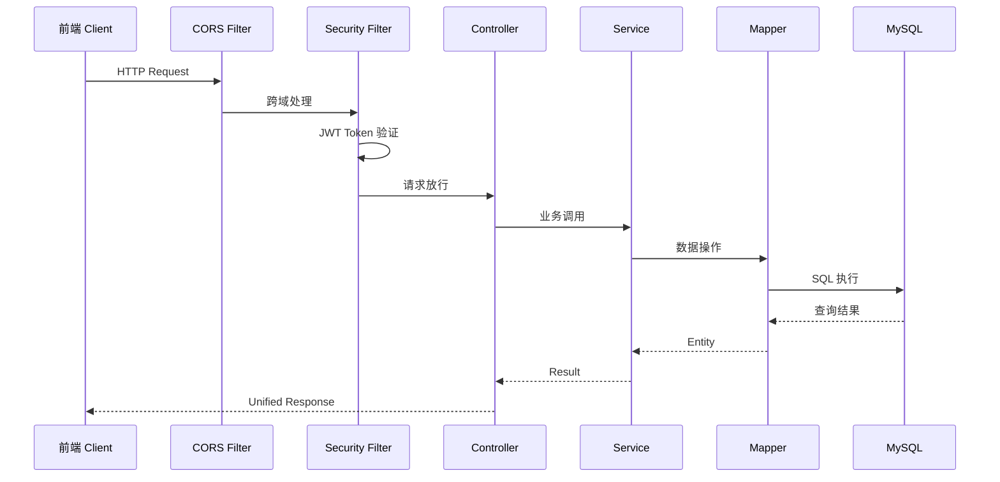
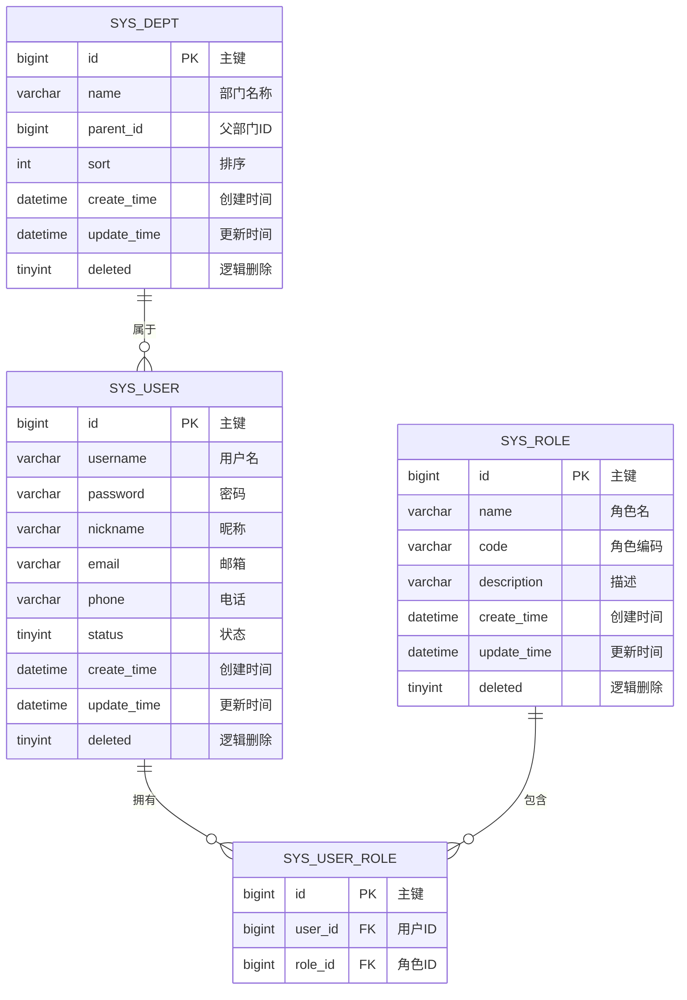

# JOSP-accountManageJava 规格说明书

## 1. 项目概述

- **项目名称**: JOSP-accountManageJava
- **项目类型**: Spring Boot 3 REST API 后端服务
- **核心功能**: 账户管理系统后端，提供用户、角色、部门管理的 RESTful API
- **目标用户**: 前端应用开发者，系统管理员

## 2. 技术栈

| 技术 | 版本 | 说明 |
|-----|------|-----|
| Java | 25 | 编程语言 |
| Spring Boot | 3.5.3 | 基础框架 |
| Spring Security | - | 安全框架 |
| MyBatis-Plus | 3.5.16 | ORM框架 |
| dynamic-datasource | 4.5.0 | 多数据源 |
| MySQL | 8.0 | 数据库 |
| Knife4j | 4.5.0 | API文档 |
| JWT | 0.13.0 | Token认证 |
| Hutool | 5.8.41 | 工具库 |
| Lombok | 1.18.38 | 注解处理 |

## 3. 功能模块

### 3.1 用户管理 (sys_user)
- 分页查询用户
- 根据ID查询用户
- 新增用户
- 更新用户
- 删除用户
- 批量删除用户

### 3.2 角色管理 (sys_role)
- 角色实体定义
- 角色权限控制

### 3.3 部门管理 (sys_dept)
- 部门树形结构
- 部门CRUD

## 4. 数据库设计

### 4.1 核心表

| 表名 | 说明 |
|-----|------|
| sys_user | 用户表 |
| sys_role | 角色表 |
| sys_dept | 部门表 |
| sys_user_role | 用户角色关联表 |

### 4.2 公共字段
- id: 主键（自增）
- create_time: 创建时间（自动填充）
- update_time: 更新时间（自动填充）
- deleted: 逻辑删除标记

## 5. API 设计

### 5.1 用户管理接口

| 接口路径 | 方法 | 说明 |
|---------|------|-----|
| /api/user/page | GET | 分页查询用户 |
| /api/user/{id} | GET | 根据ID查询用户 |
| /api/user | POST | 新增用户 |
| /api/user | PUT | 更新用户 |
| /api/user/{id} | DELETE | 删除用户 |
| /api/user/batch | DELETE | 批量删除用户 |

### 5.2 统一返回格式
```json
{
  "code": 200,
  "message": "操作成功",
  "data": {}
}
```

## 6. 项目结构

```
JOSP-accountManageJava/
├── src/main/java/wo1261931780/JOSPaccountManageJava/
│   ├── config/              # 配置类
│   │   ├── CorsConfig.java      # 跨域配置
│   │   ├── GlobalExceptionHandler.java  # 全局异常处理
│   │   ├── MyMetaObjectHandler.java     # 自动填充
│   │   ├── MybatisPlusConfig.java       # MyBatis-Plus配置
│   │   └── ShowResult.java              # 统一返回格式
│   ├── controller/          # 控制器层
│   │   └── SysUserController.java
│   ├── entity/              # 实体类
│   │   ├── SysUser.java
│   │   ├── SysRole.java
│   │   └── SysDept.java
│   ├── mapper/              # Mapper接口
│   │   ├── SysUserMapper.java
│   │   ├── SysRoleMapper.java
│   │   └── SysDeptMapper.java
│   ├── service/             # 服务层
│   │   ├── SysUserService.java
│   │   └── impl/SysUserServiceImpl.java
│   └── AccountManageApplication.java
├── src/main/resources/
│   ├── application.yml      # 配置文件
│   └── db_init.sql          # 数据库初始化脚本
└── pom.xml
```

## 7. 架构设计

### 7.1 系统架构图

```mermaid
graph TB
    subgraph Frontend["前端层"]
        Vue3["Vue3 Frontend<br/>JOSP-accountManagerVue3"]
    end

    subgraph Gateway["网关层"]
        Cors["CORS Config<br/>跨域配置"]
    end

    subgraph Security["安全层"]
        Security["Spring Security<br/>JWT 认证"]
    end

    subgraph Application["应用层"]
        UserController["SysUserController<br/>用户管理"]
        RoleController["SysRoleController<br/>角色管理"]
        DeptController["SysDeptController<br/>部门管理"]
    end

    subgraph Service["服务层"]
        UserService["SysUserService"]
        RoleService["SysRoleService"]
        DeptService["SysDeptService"]
    end

    subgraph Data["数据层"]
        MyBatisPlus["MyBatis-Plus 3.5.16"]
        DynamicDS["Dynamic DS 4.5.0<br/>多数据源"]
        MySQL["MySQL 8.0"]
    end

    Frontend --> Cors
    Cors --> Security
    Security --> UserController
    Security --> RoleController
    Security --> DeptController
    UserController --> UserService
    RoleController --> RoleService
    DeptController --> DeptService
    UserService --> MyBatisPlus
    RoleService --> MyBatisPlus
    DeptService --> MyBatisPlus
    MyBatisPlus --> DynamicDS
    DynamicDS --> MySQL
```

### 7.2 请求处理流程



### 7.3 数据库ER图



## 8. 配置要求

### 8.1 环境要求
- JDK 25
- Maven 3.6+
- MySQL 8.0+

### 8.2 数据库配置
配置数据源连接信息（application.yml）：
- 主数据源：MySQL
- 数据库名：account_manage

## 9. 安全特性

- Spring Security 认证
- JWT Token 认证
- 逻辑删除（软删除）
- 跨域配置

## 10. 文档

- Knife4j 在线API文档：/doc.html
- Swagger UI：/swagger-ui.html

## 11. 默认账号

- 用户名：admin
- 密码：123456

## 11. 版本历史

| 版本 | 日期 | 说明 |
|-----|------|-----|
| 1.0.0 | 2026-03-29 | 初始版本 |

## 12. 维护者

- junw
